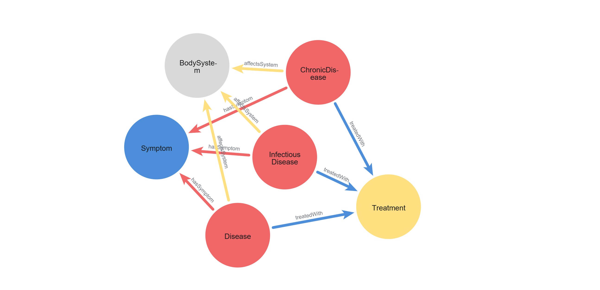
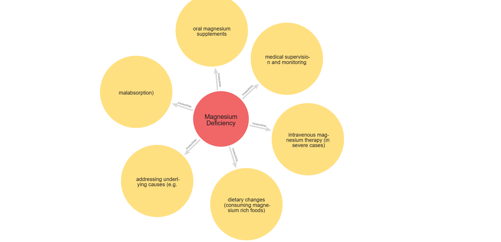
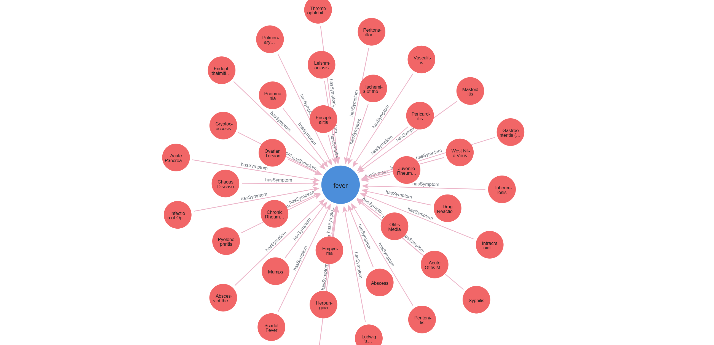
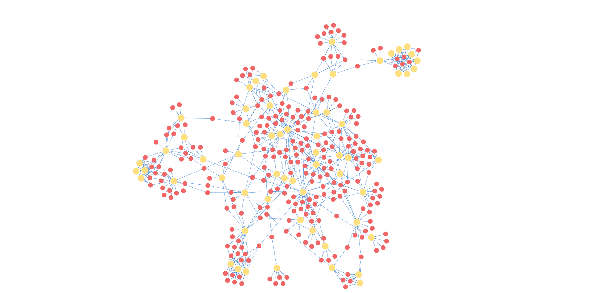

# Medical KG Reasoning Pipeline (RDF • SHACL • RDFS/OWL‑RL) + Streamlit UI

End‑to‑end, Docker‑first pipeline that converts a medical CSV into an RDF Knowledge Graph, validates it with SHACL, performs RDFS and OWL‑RL reasoning, and provides a Streamlit UI for exploration (with optional Ollama‑powered explanations).

> **Academic / demo project.** This is **not** a medical diagnosis or treatment tool.

---

## Contents

- [What this project does](#what-this-project-does)
- [Features](#features)
- [Project layout](#project-layout)
- [Quickstart (Docker)](#quickstart-docker)
- [Verify it worked](#verify-it-worked)
- [Run modes](#run-modes)
- [Local run (without Docker)](#local-run-without-docker)
- [Configuration](#configuration)
- [LLM tabs (Ollama)](#llm-tabs-ollama)
- [Neo4j import (optional)](#neo4j-import-optional)
- [Troubleshooting](#troubleshooting)
- [License / disclaimer](#license--disclaimer)

---

## What this project does

**Pipeline (high level):**

1. **Preprocess** a medical dataset (**CSV**)
2. **Build RDF instance KG** (Turtle `.ttl`)
3. **Validate** the KG with **SHACL**
4. **Reason** with **RDFS closure** and compare **RAW vs REASONED**
5. **Reason** with **OWL‑RL** to demonstrate **RDFS limitations**
6. Serve an interactive **Streamlit UI** (and optional **LLM explanations** via Ollama)

---

## Features

- CSV → RDF (Turtle) instance KG generation
- SHACL validation (RAW and inferred graphs)
- RDFS closure reasoning
- RAW vs REASONED comparison (triple deltas / type deltas / queries that change)
- OWL‑RL reasoning to highlight what RDFS cannot infer
- Streamlit UI (Docker‑friendly, port `8501`)
- Optional: import inferred KG to Neo4j (script provided)

---

## Project layout

```text
.
├─ docker-compose.yml
├─ Dockerfile
├─ docker/entrypoint.sh
├─ run_all.sh
├─ requirements.txt
├─ README.md
├─ import_medical_kg_to_neo4j.py
├─ data/
│  ├─ raw/         # original dataset(s)
│  ├─ processed/   # generated CSV + TTL files + reports
│  └─ ontology/    # schema + SHACL shapes + OWL‑RL extensions
└─ src/
   ├─ run_pipeline.py
   ├─ preprocessing/
   ├─ rdf_build/
   ├─ validation/
   ├─ reasoning/
   ├─ sparql/
   ├─ visualization/
   ├─ analysis/
   ├─ ui_prototypes/
   ├─ llm_simple/
   └─ llm_large/
```

---

## Quickstart (Docker)

### Prerequisite
- Docker Desktop installed and running

### Start pipeline + UI

From the project root:

```bash
docker compose up --build
```

Open the UI:

- http://localhost:8501

### Stop

```bash
docker compose down
```

---

## Verify it worked

After the first successful run, you should see generated artifacts under `./data/` (mounted from the container):

### Expected outputs

- `data/processed/diseases_large.csv`
- `data/processed/data_medical_large.ttl` (RAW instance KG)
- `data/processed/data_medical_large_inferred.ttl` (RDFS inferred KG)
- `data/processed/data_medical_large_owlrl_inferred.ttl` (OWL‑RL inferred KG)
- `data/processed/rdfs_limitations_report.txt`
- `data/visualizations/*.png`

### Quick sanity check (optional)

```bash
ls data/processed
ls data/visualizations
```

If these exist, the pipeline is working and persistence via Docker volume is correct.
---

## Screenshots

Add your images under `assets/` (recommended) and embed them in this README using relative paths.

### Neo4j exploration (examples)

**Ontology / schema view**



**Instance explorations**





> Tip: If images look too large on GitHub, reduce `width="900"` to `width="700"` or `width="600"`.


---

## Run modes

The Docker entrypoint supports two modes:

- `pipeline` → run end‑to‑end pipeline only
- `ui` → run pipeline and then launch the Streamlit UI

Examples:

```bash
# pipeline only
docker compose run --rm medicalkg pipeline

# pipeline + UI
docker compose run --rm -p 8501:8501 medicalkg ui
```

With the provided `docker-compose.yml`, you usually only need:

```bash
docker compose up --build
```

---

## Local run (without Docker)

### Prerequisites
- Python 3.10+ (3.11 also fine)
- Bash available (Git Bash on Windows works)

### Create a virtual environment + install deps

```bash
python -m venv .venv
# Linux/macOS:
source .venv/bin/activate
# Windows (PowerShell):
# .\.venv\Scripts\Activate.ps1

pip install -r requirements.txt
```

### Run pipeline

```bash
bash run_all.sh
```

### Run pipeline + UI

```bash
bash run_all.sh --with-ui
```

Open:

- http://localhost:8501

---

## Configuration

Environment variables used by the pipeline/UI (commonly set in `docker-compose.yml`):

| Variable | Default | Meaning |
|---|---:|---|
| `RUN_SHACL` | `1` | Run SHACL validation on RAW KG |
| `RUN_SHACL_INFERRED` | `1` | Run SHACL validation on inferred KG |
| `RUN_RDFS_LIMIT` | `1` | Run RDFS limitations demo (OWL‑RL reasoning report) |
| `RUN_STREAMLIT` | `1` | Launch Streamlit UI after pipeline |
| `OLLAMA_BASE_URL` | *(none)* | Base URL for Ollama (if using LLM tabs) |

> Tip: keep sensitive config out of Git (e.g., `.env`, Streamlit secrets).  
> This repo includes `.gitattributes` to preserve LF endings for shell scripts when collaborating across OSes.

---

## LLM tabs (Ollama)

The UI contains two LLM approaches:

- **LLM Simple**: lightweight prompt + KG context → Ollama call
- **LLM Large**: more structured integration (intent parsing + KG API + explanation pipeline)

### Run Ollama on your host

```bash
ollama pull llama3.2
ollama serve
```

### Docker → host Ollama connectivity

If Streamlit runs **inside Docker** while Ollama runs on your **host**, the container must reach the host service.

Common base URLs:

- **Windows/macOS Docker Desktop:** `http://host.docker.internal:11434`
- **Linux:** often `http://172.17.0.1:11434` (varies by setup)

Set:

```bash
export OLLAMA_BASE_URL="http://host.docker.internal:11434"
```

Or place it in `docker-compose.yml` under `environment:`.

---

## Neo4j import (optional)

A helper script is included:

```bash
python import_medical_kg_to_neo4j.py
```

You can adapt connection settings inside the script or pass parameters if supported by your version.  
Recommended: import **inferred** KG (`data_medical_large_inferred.ttl`) if you want reasoning‑enriched graphs in Neo4j.

---

## Troubleshooting

### UI starts but page won’t open
- Confirm port mapping: `8501:8501`
- Use: http://localhost:8501 (not `0.0.0.0:8501`)

### “Address already in use”
```bash
docker compose down
```

### LLM tabs fail (connection error)
- Ensure Ollama is running: `ollama serve`
- Ensure container can reach it:
  - Windows/macOS: `host.docker.internal`
  - Linux: try `172.17.0.1` or host networking

### Pipeline ran but outputs missing locally
- Confirm compose volume mapping: `./data:/app/data`
- Generated files should appear in:
  - `data/processed/`
  - `data/visualizations/`

---

## License / disclaimer

This project is intended for academic and research demonstration.  
**It is NOT a medical diagnosis or treatment tool.** Always consult qualified professionals for real medical decisions.
